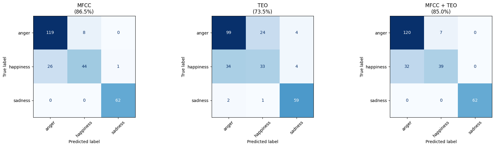
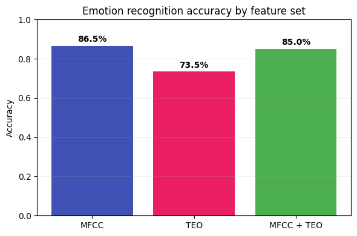

# Emotion Recognition: TEO vs MFCC

[](https://colab.research.google.com/github/MFA-X-AI/pyvoicebox/blob/master/notebooks/05_emotion_recognition.ipynb)

When someone is angry, their vocal folds tense up and vibrate more forcefully. When they're sad, the muscles relax and the voice becomes quieter and breathier. These physical changes show up in the speech signal - if you know where to look.

This example compares two feature representations from pyvoicebox on a 3-class emotion recognition task (anger, happiness, sadness) using the [EmoDB](http://emodb.bilderbar.info/) dataset. Features are extracted in a few lines with pyvoicebox, then fed into a simple Random Forest - no deep learning, no complex pipeline. Even with this minimal setup, the results are solid.

---

## Two ways to look at emotion

**MFCCs** (`v_melcepst`) capture the spectral envelope - the shape of the vocal tract. They're the standard feature for most speech tasks, including emotion recognition.

**Teager Energy** (`v_teager`) captures something different. The [Teager Energy Operator](https://en.wikipedia.org/wiki/Teager_energy_operator) is a nonlinear operator that tracks instantaneous energy:

$$\Psi[x(n)] = x(n)^2 - x(n+1) \cdot x(n-1)$$

Unlike simple energy ($x^2$), TEO is sensitive to both amplitude *and* frequency changes simultaneously. This makes it responsive to the kind of vocal fold tension changes that accompany emotional speech - faster vibration and higher amplitude during anger, slower and quieter during sadness.

We extract TEO features by applying `v_teager` per frame, then computing the FFT of the TEO signal and grouping the bins into sub-bands:

```python
from pyvoicebox import v_teager, v_enframe, v_windows, v_melcepst

# MFCC features
mfcc, _ = v_melcepst(signal, fs, 'M0', 12)

# TEO sub-band features
frames, _, _ = v_enframe(signal, frame_len, frame_hop)
win = v_windows(3, frame_len).flatten()
for frame in frames:
    teo = v_teager(frame * win)
    spec = np.abs(np.fft.rfft(teo))
    # group into sub-bands, compute log energy per band
```

For each utterance, we summarise both feature types as mean and standard deviation across frames, giving a fixed-length vector regardless of utterance duration.

---

## Results

We train a [Random Forest](https://en.wikipedia.org/wiki/Random_forest) classifier with 5-fold stratified cross-validation, comparing three feature sets: MFCC only, TEO only, and MFCC + TEO combined.



Each confusion matrix shows true emotions (rows) vs predicted emotions (columns). Some observations:

- **Sadness** is classified near-perfectly across all feature sets - it's acoustically very distinct (low energy, slow speaking rate, relaxed vocal folds).
- **Anger vs happiness** is the hardest distinction - both are high-arousal emotions with loud, fast speech. The difference lies in vocal fold tension and spectral tilt, which MFCCs capture better than TEO alone.
- **TEO alone** is weaker overall, which makes sense - it captures excitation dynamics but misses the spectral shape information that MFCCs provide.



MFCC features are the stronger standalone representation for this task. TEO captures complementary information about vocal fold dynamics, though in this setup the combination doesn't consistently outperform MFCC alone. With a more sophisticated classifier or feature fusion strategy, the complementary information in TEO could provide additional gains.

The key point: with just a few lines of pyvoicebox code for feature extraction and a simple off-the-shelf classifier, you can build a working emotion recognition system.
