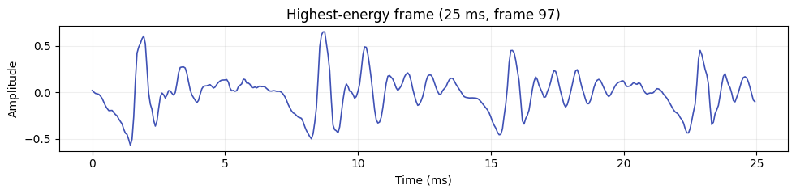
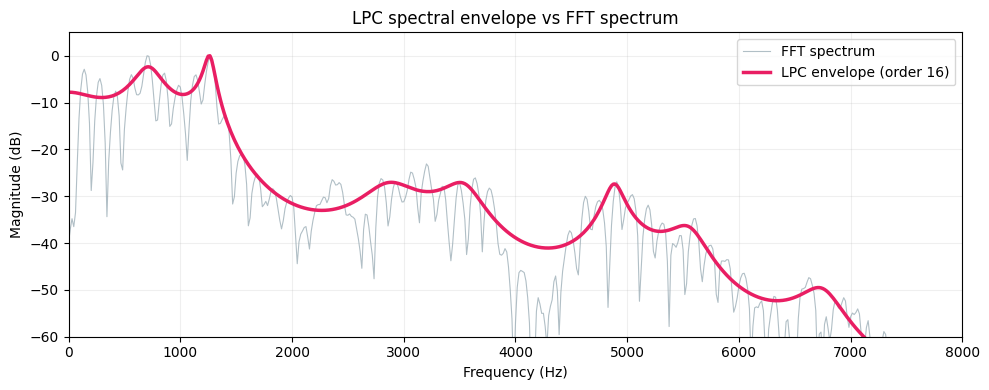
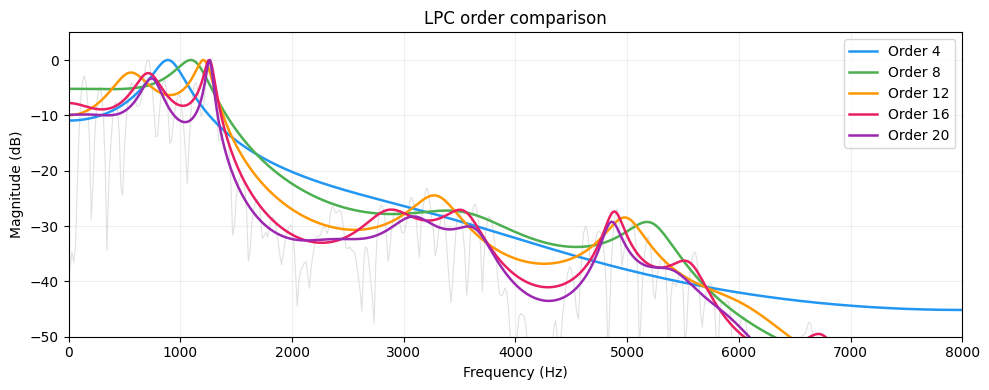
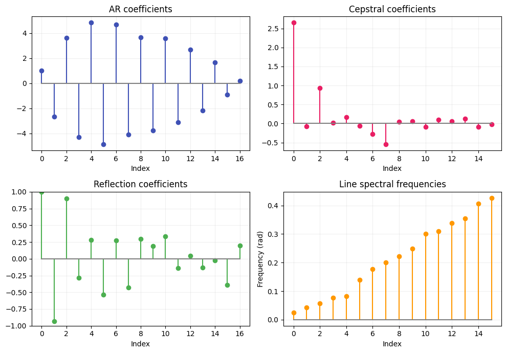
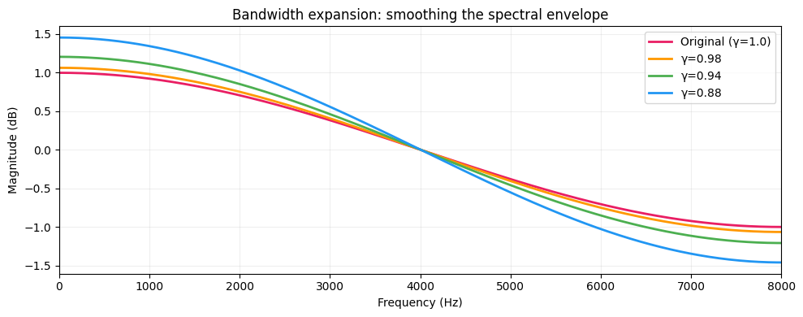

# Inside the Vocal Tract: LPC Analysis

[](https://colab.research.google.com/github/MFA-X-AI/pyvoicebox/blob/master/notebooks/03_lpc_analysis.ipynb)

## What is LPC?

When you speak, air from your lungs passes through your vocal folds (creating a buzzy excitation signal) and then resonates through your throat, mouth, and nasal cavity. These resonances — called **formants** — are what distinguish an "ah" from an "ee".

Linear Predictive Coding models this as a simple source-filter system: the current speech sample can be *predicted* as a weighted sum of previous samples. The weights (AR coefficients) encode the shape of your vocal tract.

$$\hat{x}(n) = -\sum_{k=1}^{p} a_k \, x(n-k)$$

where $p$ is the **model order** (how many past samples to use) and $a_k$ are the AR coefficients.

## Extracting LPC coefficients

`v_lpcauto` computes the AR coefficients from a speech frame using the autocorrelation method:

```python
from pyvoicebox import v_lpcauto, v_enframe, v_windows

# Frame the signal into 25 ms overlapping windows
frames, _, _ = v_enframe(signal, frame_len, frame_hop)

# Pick the highest-energy frame (guaranteed voiced)
energies = np.sum(frames**2, axis=1)
frame = frames[np.argmax(energies)]

# Compute 16th-order LPC
win = v_windows(3, frame_len).flatten()  # Hamming window
ar, e, k = v_lpcauto(frame * win, 16)
```

The windowed frame looks like this — a periodic signal with clear glottal pulses:



## LPC spectral envelope vs FFT

The FFT of a speech frame shows every harmonic — peaks at multiples of the fundamental frequency (F0). This is more detail than we usually want. The **LPC spectral envelope** smooths over the harmonics and traces just the formant peaks:



The grey line is the raw FFT — you can see the individual harmonics. The pink line is the LPC envelope (order 16). The peaks in this envelope correspond to formants:

- **F1** (~500 Hz) — related to jaw openness
- **F2** (~1500 Hz) — related to tongue position (front/back)
- **F3** (~2500 Hz) — related to lip rounding and cavity length

These three formants are enough to identify most vowels.

## Choosing the right model order

The order $p$ controls how much spectral detail the model captures. Too low and you miss formants entirely. Too high and the envelope starts tracking individual harmonics instead of the smooth vocal tract shape:



A rule of thumb for speech at sample rate $f_s$: use $p \approx f_s / 1000 + 4$. For 16 kHz speech, that's about 20. For formant tracking, 12-16 is typical.

## Alternative representations

The AR coefficients $a_k$ are one way to represent the vocal tract model, but there are others — each with different mathematical properties. `pyvoicebox` converts freely between all of them:

```python
from pyvoicebox import v_lpcar2cc, v_lpcar2rf, v_lpcar2ls

cc = v_lpcar2cc(ar)   # cepstral coefficients
rf = v_lpcar2rf(ar)   # reflection coefficients
ls = v_lpcar2ls(ar)   # line spectral frequencies
```



Why would you use one over another?

| Representation | Key property | Used in |
|---|---|---|
| **AR coefficients** | Direct filter form | General LPC analysis |
| **Cepstral coefficients** | Decorrelated, good for distance metrics | Speech/speaker recognition (MFCCs) |
| **Reflection coefficients** | Bounded in [-1, 1], guaranteed stable | Lattice filters, stability checking |
| **Line spectral frequencies** | Good interpolation, pairs in [0, $\pi$] | Speech coding (e.g. CELP codecs) |

## Bandwidth expansion

In speech synthesis and coding, you sometimes want to widen the formant peaks — making the spectral envelope smoother. `v_lpcbwexp` does this by multiplying each AR coefficient $a_k$ by $\gamma^k$, which pulls the filter poles toward the origin:

$$a_k' = a_k \cdot \gamma^k, \quad 0 < \gamma \leq 1$$

Smaller $\gamma$ = more smoothing:

```python
from pyvoicebox import v_lpcbwexp

ar_smooth = v_lpcbwexp(ar, 0.94)  # moderate smoothing
```



The original (pink) has the sharpest formant peaks. As $\gamma$ decreases, the peaks flatten — useful when you need a smoother spectral envelope for synthesis or interpolation between frames.
