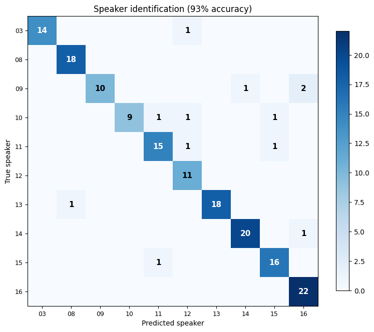
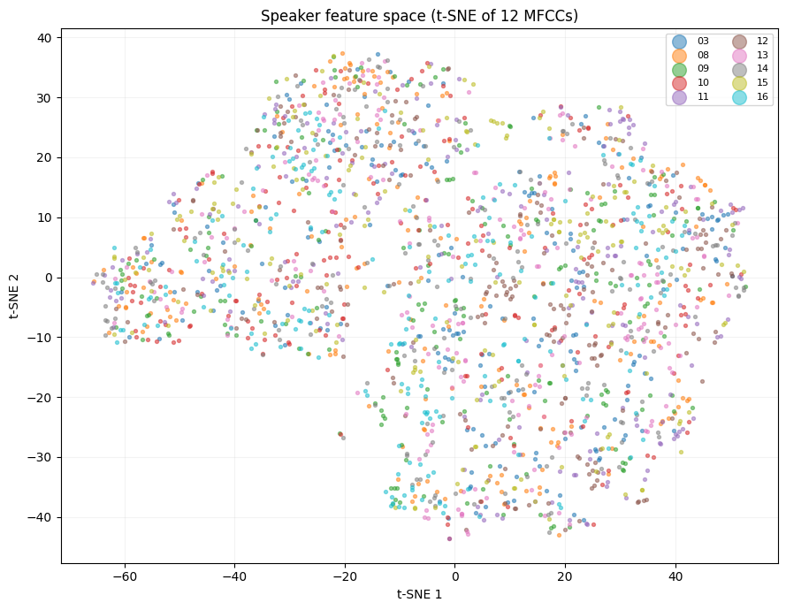

# Speaker Identification with GMMs

[](https://colab.research.google.com/github/MFA-X-AI/pyvoicebox/blob/master/notebooks/04_speaker_identification.ipynb)

Every person's voice is shaped by the physical dimensions of their vocal tract - the length of the throat, the shape of the mouth, the size of the nasal cavity. These differences show up consistently in the spectral envelope of speech, which means we can identify *who* is speaking by looking at the right features.

This example builds a complete speaker identification pipeline using only pyvoicebox: extract MFCCs, train a [Gaussian Mixture Model](https://en.wikipedia.org/wiki/Mixture_model#Gaussian_mixture_model) per speaker, and classify unknown utterances. The dataset is [EmoDB](http://emodb.bilderbar.info/) - 10 speakers, 535 utterances.

---

## The approach

The pipeline has three stages:

1. **Feature extraction** - compute MFCCs from each utterance using `v_melcepst`. MFCCs capture the spectral envelope (vocal tract shape) while discarding pitch and loudness variations.

2. **Training** - for each speaker, fit an 8-component GMM to their pooled MFCC frames using `v_gaussmix`. The GMM learns the distribution of spectral shapes that characterise that speaker's voice.

3. **Classification** - for an unknown clip, score its MFCC frames against every speaker's GMM using `v_gaussmixp`. The speaker whose model assigns the highest total [log-likelihood](https://en.wikipedia.org/wiki/Likelihood_function#Log-likelihood) wins.

The log-likelihood of a frame $\mathbf{x}$ under a GMM with $K$ components is:

$$\log p(\mathbf{x}) = \log \sum_{k=1}^{K} w_k \, \mathcal{N}(\mathbf{x} \mid \boldsymbol{\mu}_k, \boldsymbol{\Sigma}_k)$$

where $w_k$ are mixture weights, $\boldsymbol{\mu}_k$ are means, and $\boldsymbol{\Sigma}_k$ are covariances. For a full clip, we sum the log-likelihoods across all frames.

---

## Feature extraction and training

```python
from pyvoicebox import v_melcepst, v_gaussmix, v_gaussmixp

# Extract 12 MFCCs per frame
def extract_mfcc(wav_path, n_cep=12):
    signal, fs = sf.read(wav_path)
    mfcc, _ = v_melcepst(signal, fs, 'M', n_cep)
    return mfcc

# Train an 8-component GMM per speaker
n_mix = 8
gmm_models = {}
for spk in speakers:
    data = train_features[spk]  # pooled MFCC frames
    m, v, w, g, f, pp, gg = v_gaussmix(data, m0=n_mix)
    gmm_models[spk] = (m, v, w)
```

## Classification and results

```python
# Score each test clip against all speaker GMMs
for clip_mfcc in test_clips[spk]:
    scores = []
    for spk in speakers:
        m, v, w = gmm_models[spk]
        lp, _, _, _ = v_gaussmixp(clip_mfcc, m, v, w)
        scores.append(np.sum(lp))  # total log-likelihood
    predicted = speakers[np.argmax(scores)]
```



The confusion matrix shows true speakers (rows) vs predicted speakers (columns). The strong diagonal means most clips are correctly identified. With 10 speakers and a simple 8-component GMM, we reach **93% accuracy** - all from MFCC features and pyvoicebox's built-in GMM implementation.

Off-diagonal entries show which speakers get confused with each other. This typically happens when speakers have similar vocal tract dimensions (e.g., two speakers of the same gender and similar age).

---

## Visualising the feature space

To see *why* the GMM works, we can project the 12-dimensional MFCC space into 2D using [t-SNE](https://en.wikipedia.org/wiki/T-distributed_stochastic_neighbor_embedding). t-SNE preserves local neighbourhood structure, so points that are close in 12D stay close in the plot:

```python
from sklearn.manifold import TSNE

tsne = TSNE(n_components=2, perplexity=30, random_state=42)
X_2d = tsne.fit_transform(X_all)
```



Each colour is a different speaker. The visible clusters confirm that different speakers occupy distinct regions of the MFCC space - which is exactly what the GMM learns to separate. The full 12-dimensional space provides even better separation than what's visible in this 2D projection.
