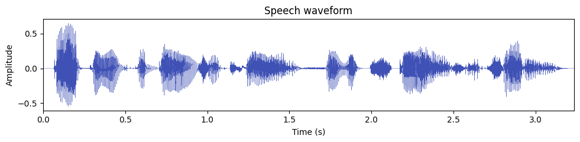
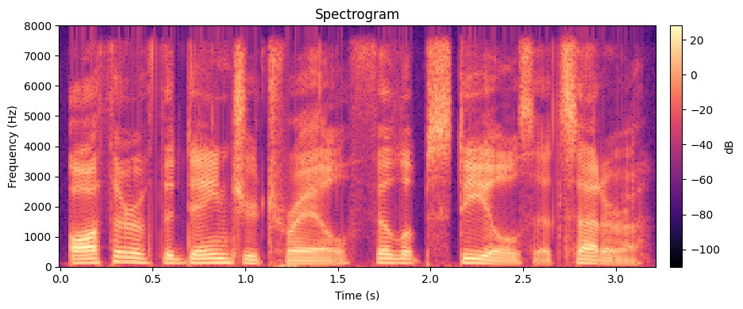
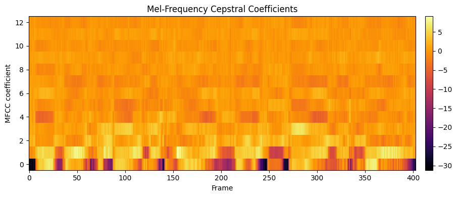
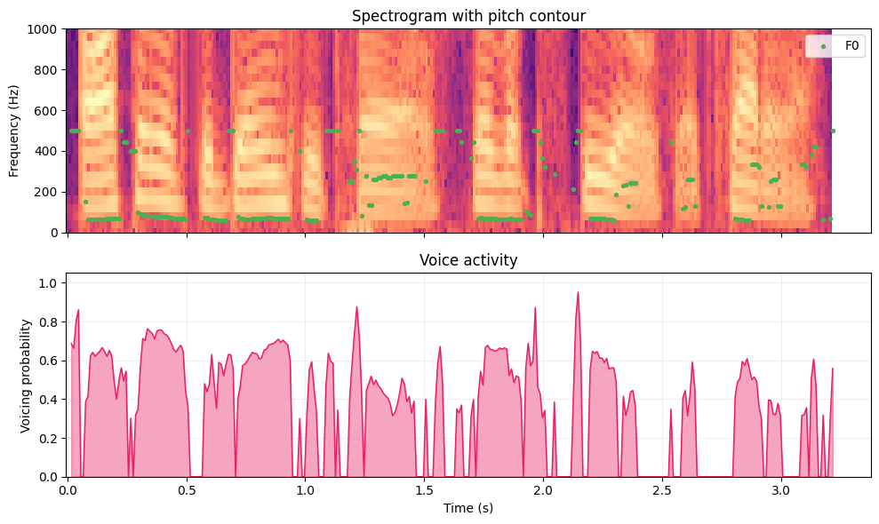

# Visualize Speech

[](https://colab.research.google.com/github/MFA-X-AI/pyvoicebox/blob/master/notebooks/01_speech_analysis.ipynb)

Speech analysis is the process of breaking an audio signal down into representations that reveal *what* is being said and *how* it is being said. In this example we take a single sentence and walk through four increasingly rich views of it: the raw waveform, a spectrogram, MFCCs, and a pitch track. Each step uses a small set of `pyvoicebox` functions, so you can see exactly how the pieces fit together.

The audio clip is **CMU Arctic `arctic_a0001.wav`** from speaker **bdl** - a recording of the sentence:

> "Author of the danger trail, Philip Steels, etc."

---

## Waveform

A waveform is the most direct representation of sound: amplitude on the vertical axis, time on the horizontal axis. It tells you *when* sound energy is present, but not much about *which* frequencies are involved.

```python
import numpy as np
import soundfile as sf
import matplotlib.pyplot as plt

signal, fs = sf.read("arctic_a0001.wav")
duration = len(signal) / fs

t = np.arange(len(signal)) / fs

fig, ax = plt.subplots(figsize=(10, 2.5))
ax.plot(t, signal, linewidth=0.3, color="#3f51b5")
ax.set_xlabel("Time (s)")
ax.set_ylabel("Amplitude")
ax.set_title("Speech waveform")
ax.set_xlim(0, duration)
plt.tight_layout()
plt.show()
```



A few things to notice:

- **Voiced regions** (the vowels in "Author", "danger", "trail") show large, periodic oscillations - these are produced by vibrating vocal folds.
- **Pauses and stop consonants** appear as near-silent gaps (for example, the brief closure before the "t" in "trail").
- The overall **amplitude envelope** gives a rough idea of syllable boundaries, but to see what frequencies are active you need a spectrogram.

---

## Spectrogram

A [spectrogram](https://en.wikipedia.org/wiki/Spectrogram) shows how the frequency content of a signal changes over time. It is computed by taking the [Short-Time Fourier Transform (STFT)](https://en.wikipedia.org/wiki/Short-time_Fourier_transform): you slide a window across the signal, compute an FFT on each windowed segment, and stack the resulting magnitude spectra side by side.

The STFT of a signal $x(n)$ using a window $w(n)$ of length $N$ is:

$$X(m, k) = \sum_{n=0}^{N-1} x(n + mH)\, w(n)\, e^{-j2\pi kn/N}$$

where $m$ is the frame index, $H$ is the hop size (how far the window moves each step), and $k$ is the frequency bin. In practice, this gives you one spectrum per frame, and the magnitude $|X(m, k)|$ in decibels is what gets plotted as the spectrogram image.

With `pyvoicebox` the three building blocks are:

- **`v_enframe`** - chops the signal into overlapping frames (one per row).
- **`v_windows`** - generates a windowing function (Hamming, Hanning, etc.).
- **`v_rfft`** - computes the FFT of each real-valued frame.

```python
from pyvoicebox import v_enframe, v_windows, v_rfft

frame_len = int(0.025 * fs)   # 25 ms window
frame_hop = int(0.010 * fs)   # 10 ms hop

frames, frame_times, _ = v_enframe(signal, frame_len, frame_hop)
win = v_windows(3, frame_len).flatten()  # Hamming window
spectra = np.array([v_rfft(f * win) for f in frames])
mag_db = 20 * np.log10(np.abs(spectra) + 1e-10)

time_axis = np.arange(mag_db.shape[0]) * frame_hop / fs
freq_axis = np.linspace(0, fs / 2, mag_db.shape[1])

fig, ax = plt.subplots(figsize=(10, 4))
im = ax.pcolormesh(time_axis, freq_axis, mag_db.T, cmap="magma", shading="auto")
ax.set_xlabel("Time (s)")
ax.set_ylabel("Frequency (Hz)")
ax.set_title("Spectrogram")
ax.set_ylim(0, fs / 2)
plt.colorbar(im, ax=ax, label="dB", pad=0.02)
plt.tight_layout()
plt.show()
```



What you are looking at:

- **Bright horizontal bands** are [formants](https://en.wikipedia.org/wiki/Formant) - resonant frequencies of the vocal tract. The first formant ($F_1$, roughly 300--800 Hz) relates to jaw openness; the second formant ($F_2$, roughly 800--2500 Hz) relates to tongue position. Together they largely determine which vowel you hear.
- **Vertical striations** during voiced speech correspond to individual glottal pulses - the vocal folds opening and closing.
- **Dark regions** indicate silence or low-energy consonants (e.g., the "s" in "Steels" appears as diffuse high-frequency noise rather than clear formant bands).

---

## MFCCs

[Mel-Frequency Cepstral Coefficients (MFCCs)](https://en.wikipedia.org/wiki/Mel-frequency_cepstrum) are a compact representation of the spectral envelope. Instead of working with hundreds of FFT bins, MFCCs compress the spectrum down to about 12--13 coefficients per frame by:

1. Mapping the frequency axis onto the **mel scale**, which is roughly logarithmic and matches human pitch perception.
2. Applying a bank of triangular filters to capture energy in each mel band.
3. Taking the **discrete cosine transform (DCT)** of the log filter-bank energies to decorrelate them.

The result is a small feature vector per frame that captures the broad shape of the spectrum (vocal tract configuration) while discarding fine harmonic detail. This makes MFCCs the standard input features for speech recognition, speaker identification, and emotion detection systems.

`v_melcepst` handles the entire pipeline - windowing, FFT, mel filter bank, log, and DCT - in one call. The mode string `'M0'` means: use the **M**el scale and include the **0**th coefficient (log energy).

```python
from pyvoicebox import v_melcepst

mfcc, tc = v_melcepst(signal, fs, "M0", 12)
print(f"MFCC shape: {mfcc.shape}  (frames x coefficients)")

fig, ax = plt.subplots(figsize=(10, 4))
im = ax.imshow(mfcc.T, aspect="auto", origin="lower", cmap="inferno",
               interpolation="nearest")
ax.set_xlabel("Frame")
ax.set_ylabel("MFCC coefficient")
ax.set_title("Mel-Frequency Cepstral Coefficients")
plt.colorbar(im, ax=ax, pad=0.02)
plt.tight_layout()
plt.show()
```



How to read this plot:

- Each column is one time frame. Each row is one MFCC coefficient (0 through 12).
- **Coefficient 0** (the bottom row) is the log energy of the frame - it tracks overall loudness and roughly mirrors the waveform envelope.
- **Lower coefficients** (1--4) capture the broad spectral tilt and formant positions - these carry most of the vowel identity information.
- **Higher coefficients** (5--12) capture finer spectral detail. They are useful for distinguishing similar sounds, but individually they are harder to interpret.
- Color changes across time show the spectral shape shifting as the speaker moves through different phonemes in the sentence.

---

## Pitch tracking

The **fundamental frequency** ($F_0$) is the rate at which the vocal folds vibrate during voiced speech. It is what we perceive as the *pitch* of someone's voice. For a typical adult male speaker like bdl, $F_0$ is usually between 80 and 200 Hz; for adult females, 150--300 Hz.

Not all speech is voiced, though. Fricatives like "s" and "f" are produced by turbulent airflow without vocal fold vibration, and stop consonants have a brief silent closure. A pitch tracker needs to both estimate $F_0$ in voiced regions and decide where voicing is present at all.

`v_fxpefac` implements the [PEFAC](https://ieeexplore.ieee.org/document/6009507) pitch estimation algorithm. It returns three arrays: the estimated $F_0$ per frame, the frame time stamps, and a voicing probability (0 = confident unvoiced, 1 = confident voiced).

```python
from pyvoicebox import v_fxpefac

pitch, pitch_times, voicing = v_fxpefac(signal, fs)

voiced = pitch > 0  # only plot frames where F0 was detected

fig, (ax1, ax2) = plt.subplots(2, 1, figsize=(10, 6), sharex=True)

# Spectrogram with pitch overlay
ax1.pcolormesh(time_axis, freq_axis, mag_db.T, cmap="magma", shading="auto")
ax1.scatter(pitch_times[voiced], pitch[voiced], c="#4caf50", s=8, zorder=5, label="F0")
ax1.set_ylabel("Frequency (Hz)")
ax1.set_title("Spectrogram with pitch contour")
ax1.set_ylim(0, 1000)
ax1.legend(loc="upper right")

# Voicing probability
ax2.fill_between(pitch_times, voicing, alpha=0.4, color="#e91e63")
ax2.plot(pitch_times, voicing, color="#e91e63", linewidth=1)
ax2.set_xlabel("Time (s)")
ax2.set_ylabel("Voicing probability")
ax2.set_title("Voice activity")
ax2.set_ylim(0, 1.05)
ax2.grid(True, alpha=0.2)

plt.tight_layout()
plt.show()
```



The top panel overlays the detected $F_0$ contour (green dots) on the spectrogram, zoomed in to 0--1000 Hz so the pitch track is clearly visible. The bottom panel shows the voicing probability over time.

Things to observe:

- **Voiced segments** (vowels in "Author", "danger", "trail", and the nasal "n" in "danger") show a smooth $F_0$ contour around 100--150 Hz, with the voicing probability near 1.0.
- **Unvoiced segments** (the "s" in "Steels", the "th" in "Author", pauses between words) have no green dots, and the voicing probability drops toward 0.
- The **pitch contour** is not flat - it rises and falls with the natural intonation of the sentence. These prosodic patterns carry information about emphasis, phrasing, and whether the speaker is asking a question or making a statement.
