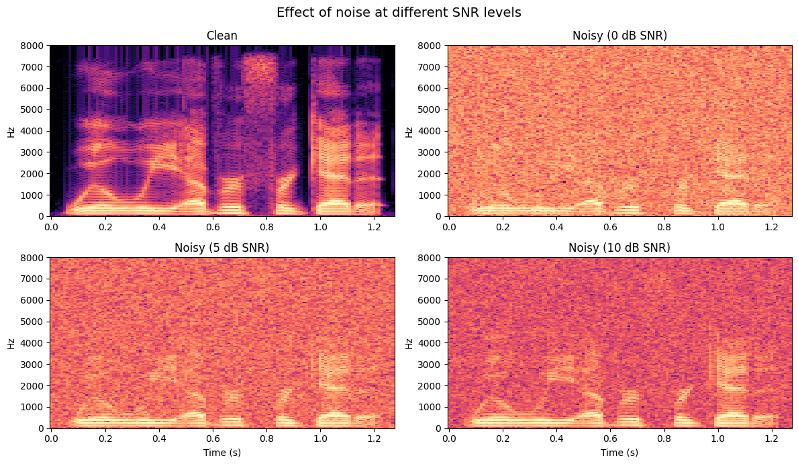
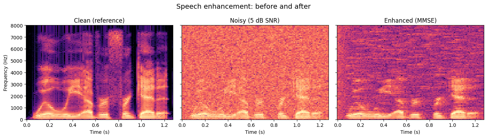

# Clean Up Noisy Speech

[](https://colab.research.google.com/github/MFA-X-AI/pyvoicebox/blob/master/notebooks/02_speech_enhancement.ipynb)

Real-world speech is rarely clean. Microphones pick up background noise, room reverb, and competing speakers. Speech enhancement algorithms try to recover the original speech from a noisy recording. In this example we add controlled noise to a clean signal, apply an MMSE estimator to clean it up, and measure how much we recovered.

The audio clip is **CMU Arctic `arctic_a0005.wav`** from speaker **bdl** - a recording of the sentence:

> "For the twentieth time that evening the two men shook hands."

---

## Adding noise

Before we can test an enhancement algorithm, we need noisy speech with a known signal-to-noise ratio (SNR). The [SNR](https://en.wikipedia.org/wiki/Signal-to-noise_ratio) measures how much louder the speech is compared to the noise, in decibels:

$$\text{SNR} = 10 \log_{10} \frac{P_{\text{signal}}}{P_{\text{noise}}} \; \text{dB}$$

At 0 dB, the noise has the same power as the speech - it's very difficult to understand. At 10 dB, the speech is 10x more powerful than the noise - noticeable but manageable.

`v_addnoise` adds white Gaussian noise to a signal at a target SNR. The `'k'` flag preserves the original signal level (without it, the function normalises total power to 1, which can distort the scale):

```python
from pyvoicebox import v_addnoise

noisy_0db, _ = v_addnoise(clean, fs, 0, 'k')    # equal noise and speech power
noisy_5db, _ = v_addnoise(clean, fs, 5, 'k')    # speech is ~3x louder
noisy_10db, _ = v_addnoise(clean, fs, 10, 'k')  # speech is ~10x louder
```



In the spectrograms above, notice how the **formant bands** (the horizontal bright lines that carry vowel information) become progressively harder to see as the SNR drops. At 0 dB, the noise floor almost completely masks the speech structure.

---

## MMSE speech enhancement

The [Minimum Mean Square Error (MMSE)](https://en.wikipedia.org/wiki/Minimum_mean_square_error) spectral amplitude estimator is a classical approach to single-channel noise reduction. The idea is:

1. Estimate the noise spectrum from non-speech regions (or track it adaptively).
2. For each time-frequency bin, estimate the *a priori* SNR - how much speech energy is expected relative to the noise.
3. Compute a gain function that attenuates bins dominated by noise and preserves bins dominated by speech.
4. Multiply the noisy spectrum by this gain to get the enhanced spectrum.

The gain for each bin depends on the estimated SNR through a modified Bessel function, which gives the MMSE-optimal spectral amplitude estimate under Gaussian assumptions.

`v_ssubmmse` handles all of this in one call:

```python
from pyvoicebox import v_ssubmmse

enhanced = v_ssubmmse(noisy_5db, fs)
```



Comparing the three spectrograms:

- **Clean** (left) - sharp formant bands, clear harmonic structure.
- **Noisy** (centre) - the 5 dB noise floor fills the gaps between harmonics and blurs the formants.
- **Enhanced** (right) - the noise floor is substantially reduced. The formant bands reappear, though some very quiet speech segments may lose energy (a common trade-off called "musical noise").

---

## Measuring improvement

Subjective listening is important, but we also want a number. `v_snrseg` computes two metrics by comparing the enhanced signal against the clean reference:

- **Global SNR** - the overall power ratio across the entire signal.
- **Segmental SNR** - the average SNR computed per short frame. This is more perceptually meaningful because a single loud noise burst won't dominate the average.

```python
from pyvoicebox import v_snrseg

# Trim signals to the same length
min_len = min(len(clean), len(noisy_5db), len(enhanced))
c, n, e = clean[:min_len], noisy_5db[:min_len], enhanced[:min_len]

seg_before, glob_before, _, _, _ = v_snrseg(n, c, fs)
seg_after, glob_after, _, _, _ = v_snrseg(e, c, fs)
```

A positive improvement in both metrics confirms the enhancement is working. Typical MMSE enhancement on white noise at 5 dB SNR yields a few dB of improvement - modest, but clearly audible. The notebook includes audio players so you can listen to the clean, noisy, and enhanced signals side by side.
